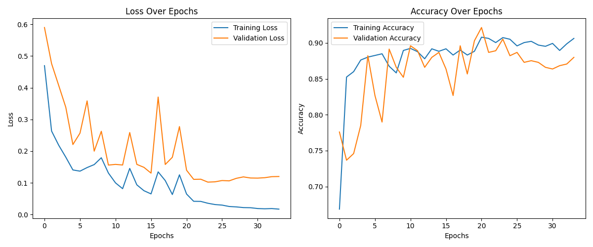
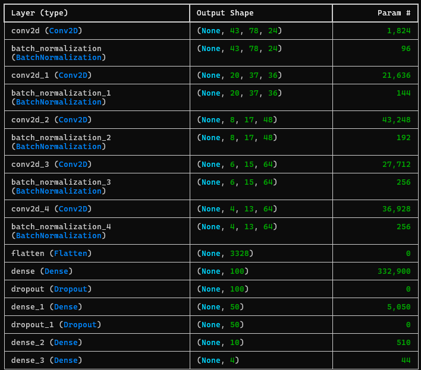

# TrackMania AI - Neural Network Driver

An AI agent that learns to play TrackMania using computer vision and deep learning. The system captures gameplay footage, records player inputs, trains a convolutional neural network, and then autonomously drives in the game.


## 🎮 How It Works

The project uses imitation learning to train an AI driver:

1. **Data Collection**: Records screen captures and keyboard inputs while you play
2. **Training**: Uses the recorded data to train a CNN that maps visual input to driving actions
3. **Inference**: The trained model plays the game by predicting the right keys to press

## 🚀 Features

- Real-time screen capture and input recording
- Data augmentation (horizontal flip, brightness adjustment)
- CNN architecture optimized for driving tasks
- Live AI gameplay with FPS monitoring
- Configurable screen region and key mappings

## 📁 Project Structure

```
trackmania-ai/
├── data_collection.py    # Records gameplay data
├── train_model.py       # Trains the neural network
├── run_agent.py         # Runs the trained AI
├── trackmania_model.h5  # Pre-trained model
├── models/              # Directory for saved models
├── dataset_opencv/      # Training data (generated)
├── training_history.png # Training visualization (generated)
├── maps                 # TrackMania map
└── README.md
```

## 🛠️ Installation

### Prerequisites

- Python 3.7+
- TrackMania
- Windows OS (for pydirectinput compatibility)

### Dependencies

Install the required packages:

```bash
pip install opencv-python numpy mss pynput tensorflow scikit-learn matplotlib pydirectinput pathlib
```

Or create a requirements.txt:

```bash
pip install -r requirements.txt
```

## 📊 Usage

### Step 1: Data Collection

First, collect training data by recording your gameplay:

```bash
python data_collection.py
```

**Instructions:**
1. Run the script
2. Switch to TrackMania window within 5 seconds
3. Play the game normally using W, A, S, D keys
4. Press **ESC** to stop recording


**Tips for good training data:**
- Record diverse tracks and situations
- Include both good and corrective driving
- Aim for at least 1000-2000 frames
- Drive smoothly and consistently

### Step 2: Train the Model

Train the neural network on your collected data:

```bash
python train_model.py
```

The training process:
- Loads and augments your data (2x increase through flipping/brightness)
- Uses a CNN architecture inspired by NVIDIA's self-driving car model
- Includes batch normalization and dropout for better generalization
- Saves the best model based on validation loss



**Model Architecture:**
```
Conv2D(24, 5x5, stride=2) → BatchNorm → ReLU
Conv2D(36, 5x5, stride=2) → BatchNorm → ReLU
Conv2D(48, 5x5, stride=2) → BatchNorm → ReLU
Conv2D(64, 3x3) → BatchNorm → ReLU
Conv2D(64, 3x3) → BatchNorm → ReLU
Flatten → Dense(100) → Dropout → Dense(50) → Dropout → Dense(10) → Dense(4)
```

### Step 3: Run the AI

Let the trained AI play the game:

```bash
python run_agent.py
```

**Instructions:**
1. Run the script
2. Click on TrackMania window within 5 seconds
3. Watch the AI drive!
4. Press **Ctrl+C** to stop


## ⚙️ Configuration

### Screen Capture Settings

Modify the monitor configuration in each file to match your setup:

```python
MONITOR_CONFIG = {"top": 393, "left": 0, "width": 1920, "height": 687}
```

To find your game window coordinates:
1. Run TrackMania in windowed mode
2. Use a tool like Windows Snipping Tool to measure the game area
3. Update the coordinates accordingly

### Key Mappings

Currently supports WASD controls:
```python
ACTION_KEYS = ['w', 'a', 's', 'd']  # Forward, Left, Backward, Right
```

### Model Parameters

Training parameters can be adjusted in `train_model.py`:
```python
IMG_HEIGHT = 90      # Input image height
IMG_WIDTH = 160      # Input image width
EPOCHS = 50          # Training epochs
BATCH_SIZE = 32      # Batch size
```

## 📈 Performance Tips

### For Better Training Data:
- Play consistently and smoothly
- Include various track types and conditions
- Record recovery maneuvers when going off-track
- Collect 2000+ frames for better results

### For Better Model Performance:
- Increase training data size
- Adjust the prediction threshold in `run_agent.py`
- Fine-tune the CNN architecture
- Use different augmentation techniques

### Troubleshooting:
- **Low FPS during AI play**: Reduce image resolution or simplify model
- **AI drives poorly**: Collect more diverse training data
- **Keys not registering**: Check if TrackMania window has focus
- **Screen capture issues**: Verify monitor configuration coordinates

## 🔧 Technical Details

### Data Augmentation
- **Horizontal flip**: Mirrors images and swaps left/right controls
- **Brightness adjustment**: Varies lighting conditions randomly

### Training Process
- Uses binary crossentropy loss (multi-label classification)
- Adam optimizer with learning rate scheduling
- Early stopping to prevent overfitting
- Model checkpointing saves the best weights

### Inference
- Real-time screen capture at ~30-60 FPS
- Image preprocessing (resize, normalize)
- Threshold-based key press decisions (default: 0.85)

## 🤝 Contributing

Feel free to contribute improvements:

1. Fork the repository
2. Create a feature branch
3. Make your changes
4. Submit a pull request

Potential improvements:
- Support for other racing games
- More sophisticated neural architectures
- Real-time training/adaptation
- Multi-track performance optimization

## 🎯 Results

After training on ~2000 frames of gameplay data:
- The AI successfully navigates basic tracks
- Maintains good racing lines on straights
- Handles simple turns and corrections
- Performance varies with track complexity


## 🙏 Acknowledgments

- Inspired by NVIDIA's "End to End Learning for Self-Driving Cars" paper
- TrackMania community for the amazing game
- OpenCV and TensorFlow communities for excellent tools

---

**Note**: This project is for educational purposes. Make sure you comply with TrackMania's terms of service when using automated gameplay tools.